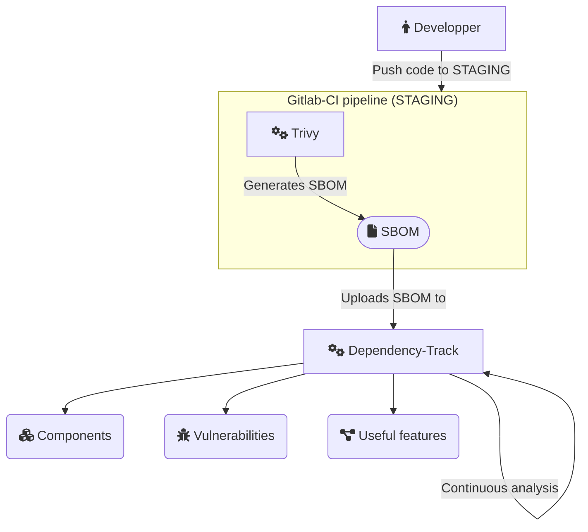

> **Ne courez plus jamais après une dépendance vulnérable !**
> {: .prompt-tip }

## Le problème

📖 Rien de pire pour une équipe de sécurité de devoir sortir l'artillerie lourde à coup d'analyseurs, scripts, `grep`, enfonçage de portes de bureau, etc... pour faire l'inventaire de toutes les applications affectées par une vulnérabilité critique dans ses dépendances (cela vous rappelle peut-être des souvenirs😊).

La **problématique** est donc la suivante : *Comment cartographier les dépendances de ses applications et assurer une analyse continue de sécurité avec des outils open source ?*

La solution que je vous partage combine des outils de **SCA** et d'**intégration continue** open source, efficaces et **GRATUITS** qui peuvent permettre d'éviter des heures de stress et de souffrance inutiles.

Elle se compose du trio magique : **Trivy + Gitlab CI + Dependency-Track**

> SCA + intégration continue = cartographie sans effort 🤩  
> {: .prompt-tip }

## SCA (Software Composition Analysis)

Le **SCA** est l'analyse des composants logiciels d'une application (ou d'un système), elle permet d'identifier les **risques** liés à l'utilisation de composants externes (vulnérabilités, obsolescence, licences, provenance...).

Pour pouvoir analyser des composants logiciels il est important de pouvoir les lister, c'est le rôle des **SBOM** (Software Bills of Materials).

Un **SBOM** est un fichier qui répertorie l'ensemble des dépendances d'une application. Il est généré à partir de l'ensemble des métadonnées fournies par les gestionnaires de package (npm, composer, pip ...) en se servant principalement de leurs "lockfiles" (composer.lock, package-lock.json, ...). Chaque dépendance est attribué d'un identifiant dont le format peut différer, les plus utilisés sont les *purl* (package URL), les *CPE* (Common Platform Enumeration) ou encore les *SWID* (Software ID).

Il existe plusieurs spécifications pour le format des SBOM dont **CycloneDX** et SPDX. Le format **CycloneDX** est le format plébiscité par l'**OWASP** car il est plus orienté sécurité que les autres.

## Dependency-Track

L'outil [Dependency-Track](https://dependencytrack.org/) développé par la communauté OWASP permet une **analyse continue de SBOM** (Software Bills of Materials) pour identifier les **vulnérabilités** présentes dans les dépendances mais pas seulement.

L'outil fournit aussi de quoi analyser les risques dans chaque projet, rechercher un composant commun à plusieurs applications, des graphes de dépendances, des notifications, de la gestion des accès, et pleins d'autres fonctionnalités !

## Trivy

[Trivy](https://github.com/aquasecurity/trivy) est un outil en ligne de commande très polyvalent qui permet la **génération de SBOM** au format CycloneDX (mais pas que).

Il dispose des fonctionnalités suivantes :

- **Analyse de vulnérabilités** de toutes les dépendances d'une application (plus besoin de lancer `npm audit` + `local-php-security-checker` + ...). A l'exclusion des dépendances de développement dans la plupart des langages (voir [ici](https://aquasecurity.github.io/trivy/v0.46/docs/coverage/language/))
- Analyse de conteneur
- Analyse d'infrastructure as code (Dockerfiles, Kubernetes, Terraform ...)
- Détection de secrets
- Signature cryptographique des SBOM
- Intégration à Visual Studio Code via un plugin
- Hautement configurable
- Très bonnes performances (comparé à [Syft](https://github.com/anchore/syft) par exemple)
- Utilise une base de données de vulnérabilités très complète

Bref, énormément de cas d'utilisation.

## Gitlab CI

[Gitlab CI](https://docs.gitlab.com/ee/ci/) est le langage de la plateforme d'intégration continue de Gitlab. Le principe est de pouvoir **automatiser** le lancement de scripts afin de faire passer une série de tests à notre code avant de le déployer.

Dans notre contexte, à chaque fois que du code est modifié sur les branches importantes (prod, préprod, ...), le CI lance la commande de génération de SBOM au format CycloneDX avec Trivy, puis l'upload vers un serveur Dependency-Track via son API.

Grâce à ce système on obtient un SBOM à chaque mise à jour de notre application et donc une **cartographie de nos dépendances toujours à jour !**

## Diagramme de flux

Je vous résume tout ça dans un petit diagramme :



## Avantages / Inconvénients de cette solution

### Avantages

- Open source, libre et gratuite
- Très peu de configuration
- Simple d'utilisation
- Basée sur des projets très maintenus (dont "Flagship" de l'OWASP )
- Equivalente aux fonctionnalités proposées par des alternatives commerciales (Snyk, JFrog Xray ...)

### Inconvénients

- Légèrement plus complexe qu'une solution "tout en un" (et encore)

## Démonstration

Cette démonstration consiste en la création d'un dépôt Gitlab qui contient le code l'application démo Symfony. Ce code a l'avantage d'utiliser plusieurs gestionnaire de dépendances (composer et yarn) ce qui permet de démontrer la facilité avec laquelle il est possible de générer un SBOM avec Trivy.

Par la suite, il faudra créer dans Dependency-Track une team qui aura une clé d'API et des permissions minimales pour accomplir la tâche d'upload de SBOM (et éventuellement de création de projet).

Ensuite, coder la pipeline d'intégration continue sur Gitlab pour lancer Trivy et uploader le SBOM sur un serveur Dependency-Track (via l'API), puis ajouter des règles (rules) pour que cette pipeline ne tourne que sur des branches spécifiques (prod et staging). Cela permettra de ne pas polluer Dependency-Track avec des branches qui ne dure que quelques jours.

Enfin, s'amuser à rajouter des dépendances vulnérables et voir comment Dependency-Track les détecte et les répertorie.

C'est parti ! 😁

### Le cobaye : l'application démo de Symfony

Comme application cobaye, je me sers de [l'application démo de Symfony](https://github.com/symfony/demo). Pour cela il faut disposer d'un environnement de développement PHP, la [CLI Symfony](https://symfony.com/download) et [tous éléments requis pour faire fonctionner une application Symfony](https://symfony.com/doc/current/setup.html#technical-requirements).

> Note : Je pourrais également forker le code du dépôt Github à mon dépôt Gitlab et m'arrêter là mais je ne l'ai pas testé et cela empêcherai de tester l'ajout des composants vulnérables avec composer.  
> {: .prompt-tip }

#### Génération de l'application démo Symfony

Je génère une nouvelle application démo :

`symfony new --dir=symfony-demo --php 8.2 --demo`

L'arborescence du dossier `symfony-demo` ressemble à ceci :


> Vous pouvez tester que l'application se lance correctement avec : `symfony server:start` mais ce n'est pas essentiel pour la démonstration.  
> {: .prompt-tip }

#### \[OPTIONNEL\] Installer Trivy sur l'environnement local

Installer [Trivy](https://aquasecurity.github.io/trivy) sur votre environnement local vous permettra de générer un SBOM et scanner les vulnérabilités dans vos dépendances. Encore mieux, si vous utilisez *VS Code* pour pouvez également installer le [plugin](https://marketplace.visualstudio.com/items?itemName=AquaSecurityOfficial.trivy-vulnerability-scanner). Pour installer Trivy je recommande la méthode par [script](https://aquasecurity.github.io/trivy/v0.46/getting-started/installation/#install-script). Voici les deux commandes qui vous serviront tout le temps :

- Générer un SBOM : `trivy fs --format cyclonedx --output sbom.json .`
- Lancer un scan de vulnérabilité : `trivy fs --scanners vuln .`

### Mise en place de l'intégration continue avec Gitlab-CI

Dans Gitlab, je crée un projet vide et suis les instructions pour intégrer un dépôt Git existant dans le projet et pousse le code (push).

Ensuite, toujours dans Gitlab, je crée un fichier `.gitlab-ci.yml`, en allant dans `Build > Pipeline editor` (vous pouvez vous servir de la template "hello world" si vous voulez). Puis j'ajoute le code suivant :

```yaml
trivy_sbom_generation:
  stage: test
  image:
    name: docker.io/aquasec/trivy:latest
    entrypoint: [""]
  variables:
    TRIVY_NO_PROGRESS: "true"
  before_script:
    - trivy --version
  script:
    - trivy fs --format cyclonedx --output sbom.json .
  artifacts:
    when: always
    paths:
      - sbom.json
  rules:
    - if: $CI_COMMIT_BRANCH == $CI_DEFAULT_BRANCH || $CI_COMMIT_BRANCH == "staging"

sbom_upload:
  stage: test
  needs:
    - trivy_sbom_generation
  variables:
    GIT_STRATEGY: none # only artifacts from previous jobs
  script:
    - | 
      curl -X "POST" --fail "https://${DEPENDENCY_TRACK_API_HOST}/api/v1/bom" \
      -H "Content-Type: multipart/form-data" \
      -H "X-Api-Key: ${DEPENDENCY_TRACK_API_KEY}" \
      -F "autoCreate=true" \
      -F "projectName=gilab-ci-test" \
      -F "projectVersion=${CI_COMMIT_BRANCH}" \
      -F "bom=@sbom.json"
  rules:
    - !reference [trivy_sbom_generation, rules]
```

Ce code directement inspiré de la [documentation de Trivy](https://aquasecurity.github.io/trivy/v0.46/tutorials/integrations/gitlab-ci/), crée un job `trivy_sbom_generation` et utilise l'image Docker de Trivy afin de lancer ses commandes avec le code sur notre dépôt. Le fichier SBOM (`sbom.json`) est ensuite publié en tant qu'[artifact](https://docs.gitlab.com/ee/ci/jobs/job_artifacts.html) sur le serveur Gitlab et pourra être récupéré par les jobs suivants. La directive `rules` permet l'exécution du job s'il s'agit de la branche principale ou celle de "staging".

Je commit ce code, la pipeline s'exécute, le job `trivy_sbom_generation` fonctionne et permet de télécharger `sbom.json` en tant qu'artifact (`Build > Pipelines > n° de la pipeline > nom du job (trivy_sbom_generation) > "job artifacts"`). Si vous avez installé Trivy en local vous pouvez vérifier que vous obtenez bien le même SBOM.


Bien ! Le seul problème c'est que le job `sbom_upload` échoue, c'est normal car je n'ai pas mis en place un serveur Dependency-Track ainsi que les variables permettant au CI d'envoyer le SBOM (clé d'API et hôte). C'est ce que je vais faire juste après.

### Déploiement un serveur Dependency-Track

Dependency-Track se déploie avec Docker. Pour cette démonstration, j'installe Docker, suis la [documentation](https://docs.dependencytrack.org/getting-started/deploy-docker/#quickstart-docker-compose) et j'ai un serveur Dependency-Track en local sur ma machine en 5min. L'identifiant par défaut de l'admin est `admin/admin` à vous de mettre ce que vous voulez.

Ensuite, pour utiliser l'API je vais dans `Administration > Access Management > Teams` , j'ajoute une team `CI` et les permissions minimales pour mon test (voir l'image ci-dessous). J'obtiens une clé d'API.


> Pour mon test j'autorise l'autocréation de projet, c'est un choix pour ne pas avoir à créer manuellement les projets dans Dependency-Track. Au niveau sécurité cela a un coût car ça peut permettre de "polluer" le serveur Dependency-Track si le CI est mal configuré (ou empoisonné) en lançant des pipelines avec un `projectVersion` et/ou `projectName` différents. A vous d'analyser les risques et de décider, plus d'informations [ici](https://docs.dependencytrack.org/usage/cicd/). Si vous choisissez de faire comme moi, vous pouvez mettre en place une mesure de réduction des risques en [limitant le nombre de pipelines qui tourne sur votre serveur Gitlab](https://docs.gitlab.com/ee/administration/instance_limits.html) (et c'est aussi un moyen d'éviter de DOS votre serveur 😉).  
> {: .prompt-info }

#### Upload d'un SBOM

Pour des raisons de facilité et étant donné que j'utilise la version SaaS de Gitlab, il me faut exposer mon API Dependency-Track sur internet. Pour cela j'utilise un [tunnel Cloudflare](https://developers.cloudflare.com/cloudflare-one/connections/connect-networks/do-more-with-tunnels/trycloudflare/) (**à ne pas faire avec des applications vulnérables au risque se voir hacker sa machine en bonne et due forme**, ici elle n'est pas vulnérable mais je préfère le dire).

Tunnel cloudflare sur l'API : `cloudflared tunnel --url http://localhost:8081`

Ensuite je peux tester l'upload d'un SBOM avec `curl` :

```bash
curl -X "POST" "https://<SUBDOMAIN>.trycloudflare.com/api/v1/bom" \
     -H 'Content-Type: multipart/form-data' \
     -H "X-Api-Key: <API_KEY>" \
     -F "autoCreate=true" \
     -F "projectName=clooudflared" \
     -F "projectVersion=test" \
     -F "bom=@sbom.json"
```

Dans Dependency-Track, le projet `clooudflared` est apparu, on est bon.


#### Configuration du Gitlab CI pour l'upload de SBOM

Pour faire fonctionner le job `sbom_upload`, il faut définir des variables qui seront utilisées par le CI. Pour cela, je vais sur le projet Gitlab puis `Settings > CI/CD > Variables > Add variable` et j'ajoute les variables `DEPENDENCY_TRACK_API_HOST` et `DEPENDENCY_TRACK_API_KEY`, respectivement le nom de domaine entier de votre API Dependency-Track et la clé d'API. La clé d'API est un secret, elle doit avoir la propriété `masked`.

Pour tester que tout fonctionne, `Build > Pipelines > Run pipeline > Master > run pipeline`. Si tout va bien, la pipeline réussie et le projet s'affiche dans Dependency-Track.


Maintenant que tout fonctionne, je peux m'amuser à rajouter des dépendances vulnérables et voir comment Dependency-Track les détecte sans plus de configuration.

#### Ajout d'un composant vulnérable

Le composant `guzzlehttp/guzzle:7.4.4` est actuellement affectés par [2 vulnérabilités](https://packagist.org/packages/guzzlehttp/guzzle/advisories?version=6324344).

Dans le dossier du dépot local de l'application, je crée une branche `staging` et j'ajoute le composant vulnérable avec `composer require guzzlehttp/guzzle:7.4.4`.

Je commit et je push, le pipeline se lance et on observe le résultat dans Dependency-Track.


Superbe non ? Y'a plus qu'à demander à l'équipe de développement de mettre à jour Guzzle. Et si jamais à l'avenir une nouvelle vulnérabilité apparait, **on le saura !**

## Conclusion

Les fonctionnalités offertes par [Dependency-Track](https://dependencytrack.org/) + l'intégration continue permettent de toujours avoir une cartographie à jour des composants logiciels ainsi que leurs **VULNERABILITES** par analyse quotidienne.

**Il est désormais très aisé de répondre à une vulnérabilité critique qui affecterait nos applications** à l'instar de Log4J. On va sur notre serveur Dependency-Track, **on filtre, on remédie => pas de temps perdu**. Les analyseurs et autres scripts seront laissés au placard pour cette fois.

Il est également possible de mettre en place des notifications mais attention à ne pas se noyer sous la masse d'information. N'hésitez pas à aller voir toutes les super fonctionnalités de [Dependency-Track](https://dependencytrack.org/) qui n'ont pas été évoquées ici.

Et le meilleur dans tout ça c'est que si l'on combine [Dependency-Track](https://dependencytrack.org/) avec un gestionnaire de vulnérabilité tel que [DefectDojo](https://www.defectdojo.org/), là c'est toutes les vulnérabilités d'une application qui peuvent être regroupées au même endroit 🤯. Pas seulement les vulnérabilités dans les dépendances, mais aussi celles trouvées par SAST, DAST, test d'intrusion, etc...

De plus, je ne peux que vous recommander d'explorer les fonctionnalités de [Trivy](https://aquasecurity.github.io/trivy) qui pourra devenir votre meilleur allié dans bien des cas.

En complément, il est important de rappeler que la sécurité n'est pas que l'affaire des experts du domaine, c'est la coopération entre les différentes équipes qui permettent de garantir un niveau de sécurité élevé, d'où le fait que la culture **DevOps** se dirige vers une culture **DevSecOps**. Dans ce contexte, il est utile de former au sein des équipes de développement des "**security champions**" qui pourront facilement s'occuper de la détection et remédiation des vulnérabilités dans les dépendances.

Enfin, grâce à l'automatisation générée par cette solution l'ingénieur cyber se libère du temps pour coder le malware de son prochain audit red team (quoi, vous faites pas ça vous ? 🤔).

#devsecops #cyber #sca #sbom #devsec #infosec #sdl #ssdl #owasp #owasp_fr #opensource

## Références

- [https://owasp.org/www-community/Component\_Analysis](https://owasp.org/www-community/Component_Analysis)
- [https://aquasecurity.github.io/trivy](https://aquasecurity.github.io/trivy)
- [https://github.com/anchore/syft](https://github.com/anchore/syft)
- [https://dependencytrack.org/](https://dependencytrack.org/)
- [https://gitlab.com/](https://gitlab.com/)
- [https://symfony.com/](https://symfony.com/)
- [https://cyclonedx.org/](https://cyclonedx.org/)
- [https://csrc.nist.gov/projects/security-content-automation-protocol/specifications/cpe](https://csrc.nist.gov/projects/security-content-automation-protocol/specifications/cpe)
- [https://csrc.nist.gov/projects/Software-Identification-SWID](https://csrc.nist.gov/projects/Software-Identification-SWID)
- [https://github.com/package-url/purl-spec](https://github.com/package-url/purl-spec)
- [https://www.defectdojo.org/](https://www.defectdojo.org/)